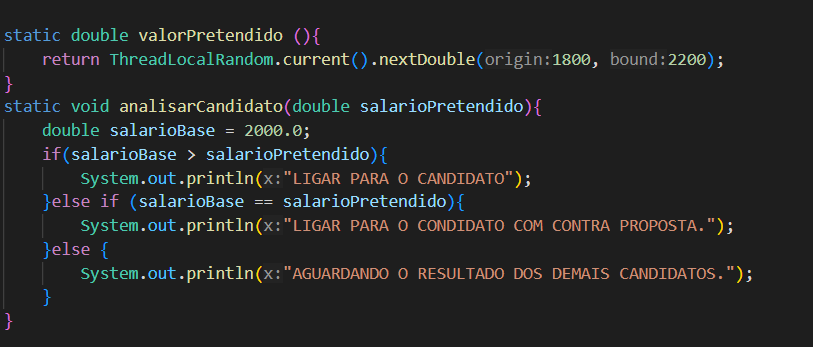

##  Controle de Candidatos
<h1> Cases </h1>
Vamos explorar alguns outros cenários, com fluxo condicionais, repetições e excepcionais.

<h2>Case 1:</h2> 
Vamos imaginar que em um processo seletivo, existe o valor base salarial de R$ 2.000,00 e o salário pretentido pelo candidato. Vamos elaborar um controle de fluxo onde:

Se o valor salário base, for maior que valor salário pretentido, imprima : LIGAR PARA O CANDIDATO;

Senão, Se o valor salário base for igual ao valor salário pretentido, imprima : LIGAR PARA O CANDIDATO, COM CONTRA PROPOSTA;

Senão imprima: AGUARDANDO RESULTADO DOS DEMAIS CANDIDATOS.

código em <strong>ProcessoSeletivo.java</strong> 


<h2>CASE 2 :</h2>
 Foi solicitado, que nosso sistema garanta que, diante das inúmeras candidaturas sejam selecionados apenas no máximo, 5 candidatos para entrevista, onde o salário pretendido seja menor ou igual ao salário base.

    Introduzimos ao metodo main o metodo selecaoCandidatos():
    Nessa lógica o laço while vai buscar os 5 candidatos da lista com o valor pretendido que se encaixa no salario base.

 

Foi importada a java.util: 'import java.util.concurrent.ThreadLocalRandom;' Para poder gerar valores aleátorios de valorPretendido de cada candidato

Se manteve a lógica If - Else para a seleção.
 
 
 saída do código no terminal.

 <h2>Case 3:</h2>
  Agora é hora de imprimir a lista dos candidatos selecionados, para disponibilizar para o RH entrar em contato.

  Agora somente fizemos a adição do metodo imprimirSelecionados():
  
  usamos o for para percorrer os selecionados e imprimir

  
  saida no terminal.


  <h2>Case 4:</h2>
O RH deverá realizar uma ligação, com no máximo 03 tentativas para cada candidato selecionado e caso o candidato atenda, deve-se imprimir:

"CONSEGUIMOS CONTATO COM _
[CANDIDATO]
 ``` APÓS **_**
[TENTATIVA]`** TENTATIVA(S)" ;**

Do contrário imprima: "NÃO CONSEGUIMOS CONTATO COM O _
[CANDIDATO]
_".

FOI CRIADO O METODO ENTRANDO EM CONTATO:


Foi criada a variável tentativasRealizadas, começando em 1,  a variável continuarTentando como verdadeira, caso o candidato não atenda e a variável atendeu como falso, para que nosso contador permita executar outras tentativas.
 Em seguida no metodo DO WHILE, no DO, a variável atendeu vai receber o metodo auxiliar atender(),no qual falarei em breve. E a variável continuarTentando será o oposto de ateudeu. A condicional IF para continuar tentando caso o candidato não atenda, e a condicional ELSE para caso o contato seja realizaado.

 Agora o metodo auxiliar
 
  o metodo atender() recebera um retorno no qual irá gerar valores aleatórios entre 1 e 3 durante as tentavivas realizadas(maximo 3). Se o seu valor for igual a 1, o candidato atendeu.